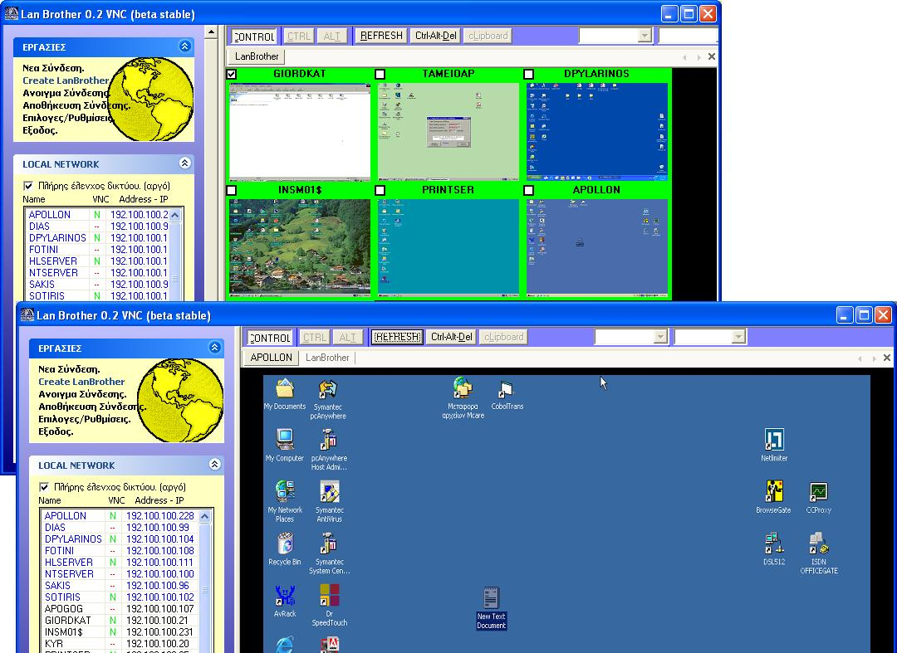



## Lan Brother VNC  \(beta Stable\)

### Description

A great VNC Remote Control tool for Network administrators that has LanTV Function.

This is my first contribution to PSC from which i use a lot of source code in the past 2 years.

The project is a pre Release i've been working for a week now.i'm posting it to get feedback suggestions and improvements.

The code is messy with greek comments, i'll work on that soon.

The app uses 4 external ocx's/dlls that i can't upload to PSC but i've included the download links in the README FIRST.TXT , so read it before opening the project.I've tested it on Windows XP pro and WIN2000 sp3 and works fine compiled or not once the ocx's are properly registered.

The password feature is very basic at this time,no data encryption, and no silent deployment of the VNC server yet (to implement) so u'll have to download and install a vnc server on the machines u wish to connect.

The project is under heavy development and it WILL FINISH.

Feedback comments will be appreciated.

Thanks
 
### More Info
 

             |
---                |---
**Submitted On**   |2005-02-24 20:22:20
**By**             |[Sotos \- Salonica](https://github.com/Planet-Source-Code/PSCIndex/blob/master/ByAuthor/sotos-salonica.md)
**Level**          |Advanced
**User Rating**    |4.4 (22 globes from 5 users)
**Compatibility**  |VB 6\.0
**Category**       |[Complete Applications](https://github.com/Planet-Source-Code/PSCIndex/blob/master/ByCategory/complete-applications__1-27.md)
**World**          |[Visual Basic](https://github.com/Planet-Source-Code/PSCIndex/blob/master/ByWorld/visual-basic.md)
**Archive File**   |[Lan\_Brothe1857032242005\.zip](https://github.com/Planet-Source-Code/sotos-salonica-lan-brother-vnc-beta-stable__1-59119/archive/master.zip)

